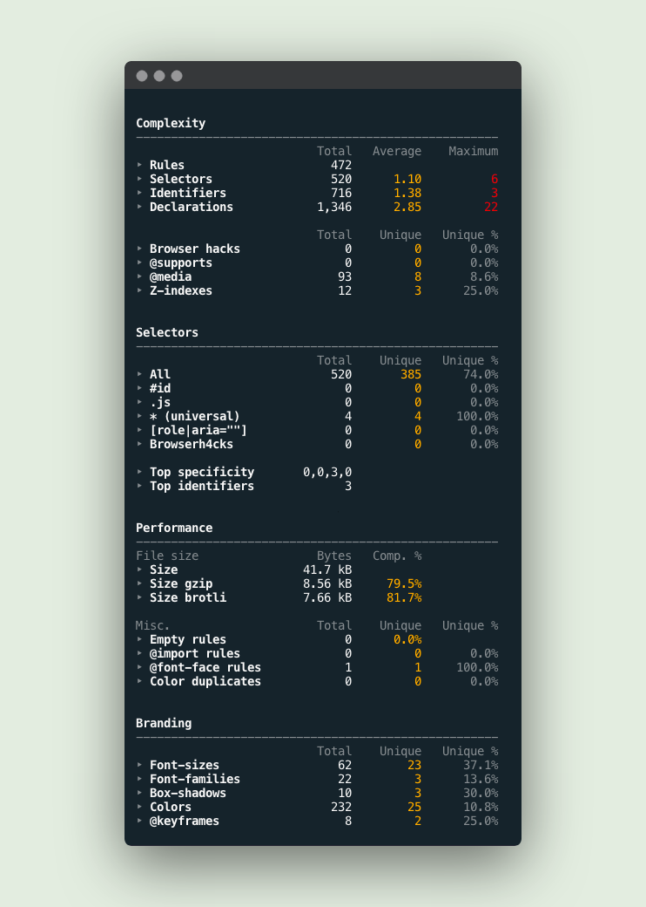

<div align="center">
  <h1>Wallace CLI</h1>
  <p>Pretty CSS analytics in your terminal.</p>
</div>

[](https://www.npmjs.com/package/wallace-cli)
[](https://travis-ci.com/bartveneman/wallace-cli)
[](https://snyk.io/test/github/bartveneman/wallace-cli?targetFile=package.json)
[](https://github.com/sindresorhus/xo)


[](https://www.projectwallace.com/oss)

## Install

```sh
npm install -g wallace-cli
# or
yarn global add wallace-cli
```

## Usage

```sh
Usage
  $ wallace projectwallace.com

  Options
  --format, -f Format pretty (default) or JSON
  --verbose, -v Show verbose analytics output

  Examples
  $ wallace https://projectwallace.com
  $ wallace 'body { color: red; }'
  $ echo 'html { font-size: 16px; } | wallace
  $ wallace 'html {}' --format=json
  $ cat style.css | wallace --verbose
  $ curl http://localhost/css/style.css | wallace
```

## Example output



## Related projects

- [Extract CSS](https://github.com/bartveneman/extract-css-core) - Extract all
  CSS from a given url, both server side and client side rendered. Used in this
  module.
- [CSS Analyzer](https://github.com/projectwallace/css-analyzer) - The analyzer
  that powers this module
- [Constyble](https://github.com/bartveneman/constyble) - A CSS complexity
  linter, based on css-analyzer. Don't let your CSS grow beyond the thresholds
  that you provide.
